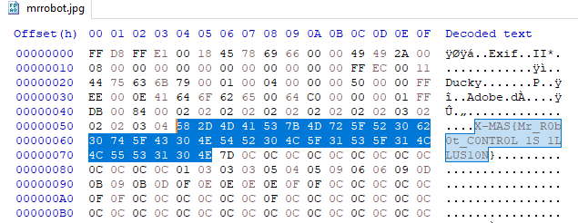

# Easy points

You can open the image you've been givin with something the let's you have a look into the binary of the file.
In it you will notice that the flag is visible in plain text within the first few bytes.

The flag is: X-MAS{Mr_R0b0t_C0NTR0L_1S_1LLUS10N}
